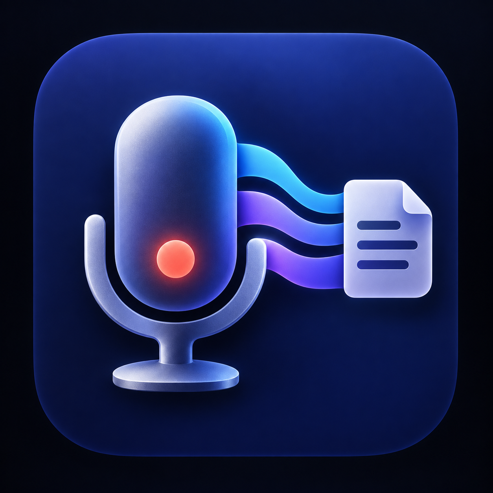

# Meeting Recorder

macOS上でマイクとシステム音声をローカル録音し、多言語文字起こし、声ごとの話者分類、全文ログ、議事録を作成するMVPです。



## 特徴

- ScreenCaptureKitでシステム音声を直接取得。Zoomや既定の出力デバイス設定は変更しません。
- 任意のマイクをAVCaptureDeviceから直接選択。システムの既定入力は変更しません。
- 音声を5分単位のM4Aへ分割し、録音中も`session.json`を更新します。
- faster-whisperによる多言語文字起こし。
- pyannote.audioによる声ベースの話者A/B/C分類。
- Ollamaと`qwen3:4b-instruct`による、完全ローカルの構造化議事録生成。
- 録音・文字起こし・要約データはすべてMac内へ保存し、外部サービスへ送信しません。

## 必要環境

- macOS 13以上（macOS 15推奨）
- Xcode 16またはSwift 6
- ffmpeg
- Python 3.10〜3.13（音声処理用。Python 3.12推奨）
- Ollamaと`qwen3:4b-instruct`（要約用）
- 話者分類にはHugging Faceで`pyannote/speaker-diarization-community-1`の利用条件への同意とアクセストークンが必要です。

## セットアップ

```zsh
brew install ffmpeg python@3.12 ollama
brew services start ollama
ollama pull qwen3:4b-instruct
./setup_runtime.sh
./build_app.sh
open 'dist/Meeting Recorder.app'
```

初回録音時にmacOSからマイクと画面収録の許可を求められます。画面収録の権限はシステム音声取得に必要ですが、このアプリは映像をファイルへ保存しません。

話者分類を使う場合は、アプリの「設定」でHugging Faceトークンを登録します。トークンはmacOSキーチェーンへ保存されます。

Ollamaの状態は次のコマンドで確認できます。

```zsh
ollama list
curl http://127.0.0.1:11434/api/version
```

`qwen3:4b-instruct`以外を使う場合は、アプリの「設定」でモデル名を変更してください。指定モデルが見つからない場合は、インストール済みの対応モデルを自動選択します。

## 保存場所

各会議は次の場所へ独立して保存されます。

```text
~/Library/Application Support/MeetingRecorder/Sessions/
```

各セッションには、音声チャンク、`session.json`、`transcript.md`、`transcript.json`、`minutes.md`が入ります。

## 現時点の制約

- 録音後に文字起こしを実行する方式です。ライブ字幕はまだありません。
- 複数ディスプレイ環境では先頭ディスプレイのシステム音声フィルターを使用します。音声はmacOS全体から取得されます。
- ローカルにApple Development証明書があれば自動的に安定署名し、なければアドホック署名します。一般配布にはDeveloper ID署名と公証が必要です。

## トラブルシューティング

システム音声の権限を拒否した場合は、次を実行してからアプリを開き直してください。

```zsh
tccutil reset ScreenCapture local.meeting-recorder
```

その後、macOSの「プライバシーとセキュリティ」→「画面とシステムオーディオの収録」でMeeting Recorderを許可します。

## ライセンス

現時点ではオープンソースライセンスを設定していません。リポジトリは公開されていますが、再利用条件は別途定める必要があります。
